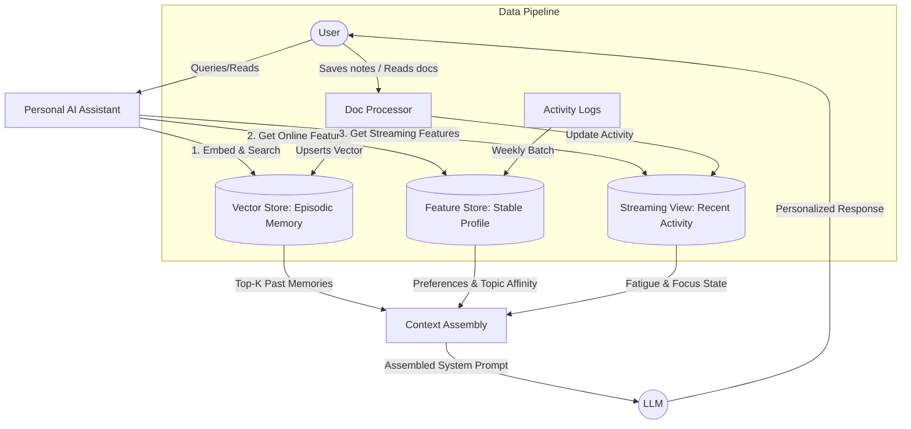

# Bonus Challenge — Build Your Own AI Memory

## Architecture Diagram

## Architecture Decisions

### 1. Chunking Strategy for Episodic Memory
**Decision:** We will use **Semantic Break Chunking** (splitting by natural paragraph or topic changes) combined with a sliding token window (max 256 tokens per chunk, overlapping by 32 tokens).

**Tradeoffs:**
- *Retrieval Quality vs. Storage Cost:* Semantic chunking significantly improves retrieval quality because each chunk represents a cohesive thought or statement. The overlap ensures context isn't lost at boundaries. However, it requires more advanced parsing logic (like using NLTK or spacy to detect sentence boundaries) and costs more storage compared to naive fixed-length chunking (e.g., exactly 500 characters).
- *Context Window:* 256-token chunks fit nicely into the LLM context window, allowing us to retrieve top-5 or top-10 memories (up to ~2500 tokens) without starving the context window of instructions or streaming features, while still leaving enough room for generation.

### 2. Feature Schema for User Profile
**Decision:** The User Profile will utilize a **Tabular Features** pattern rather than pure embedding features for core preferences, alongside a few derived behavioral scores.

*Schema Breakdown:*
- `user_id` (Entity Key)
- `preferred_language` (String: vi, en, mix) - TTL: 30 days. Source: Derived from conversation history language detection.
- `reading_speed_wpm` (Float) - TTL: 30 days. Source: Client-side reading events.
- `topic_affinity` (List of Strings) - TTL: 7 days. Source: Weekly batch job analyzing read documents.
- `fatigue_score` (Float) - TTL: 1 hour. Source: Streaming feature based on query length and frequency at late hours.

**Why this pattern?**
Tabular features provide high explainability and deterministic behavior. We can construct explicit prompts (e.g., "The user prefers language: vi") rather than relying on latent embedding preferences which the LLM might hallucinate. It also allows hard filtering (e.g., boosting documents in their preferred language) in the retrieval layer before LLM generation.

### 3. Freshness Strategy
**Decision:** We adopt a tiered freshness strategy depending on the volatility of the information.
- *Episodic Memory (Vector Store):* Sub-second freshness. New notes or read documents are embedded and inserted instantly.
- *Recent Activity (Streaming Features):* Sub-second freshness (Push API). Queries from the last hour or current task focus must be updated immediately so the assistant doesn't ask repetitive questions.
- *Stable Profile (Batch Features):* Weekly refresh. Topic affinities and reading speed don't change drastically day-to-day. Recomputing them weekly saves compute resources.

**Use cases demonstrating different freshness needs:**
1. *Sub-second (Streaming):* The user just queried 5 times about "Kubernetes networking" in the last 10 minutes. The next query "how to debug?" should immediately context-switch to Kubernetes without needing explicit keywords.
2. *Real-time (Episodic):* The user uploads a 5-page PDF about a new tax law. The immediate next query "what did section 3 say?" requires instant vector indexing.
3. *Weekly (Batch):* The user gradually shifts interest from Cloud Computing to AI over a month. Updating `topic_affinity` weekly is sufficient to capture this macro-trend.

## Rejected Alternative

**I considered storing the Episodic Memory as an embedding feature view directly within the Feast Feature Store, but chose to split it into a dedicated Vector Store (Qdrant).**

*Reason:* The re-index cycles and query patterns differ drastically. Feast is optimized for point-in-time (PIT) joins and key-value lookups (e.g., `user_id` -> `features`). Retrieving episodic memory requires semantic similarity search (k-NN or ANN) on the vector space. While Feast has experimental vector support, a dedicated vector database like Qdrant provides advanced indexing (HNSW), filtering by payload (e.g., `user_id`), and built-in hybrid search (BM25 + Vector), which are critical for high-recall memory retrieval.

## Vietnamese-Context Considerations

Building for Vietnamese users introduces specific NLP and cultural challenges:

- **Tokenizer Choice:** Instead of using default whitespace splitting or English-optimized tokenizers, we must use a Vietnamese-aware tokenizer (like `pyvi` or `underthesea`) for BM25 hybrid search. Vietnamese words are often composed of multiple syllables separated by spaces (e.g., "ngân hàng" is one word, not two). Default tokenizers will break the semantic meaning.
- **Code-Switching (vi/en mix):** Vietnamese developers heavily mix English technical terms (e.g., "Lỗi out of memory khi chạy docker container"). Our embedding model needs to be multilingual (e.g., `BAAI/bge-m3` instead of `bge-small-en`) to map mixed-language sentences to the correct semantic space.
- **Phonetic Typos & Telex:** Users might type without accents ("loi server") or with typos. The feature store can track a boolean `frequently_uses_telex_typos` to adjust the search strategy (e.g., applying phonetic matching or query expansion before hitting the vector store).

## Limitations of this POC

- **Multi-user Privacy Isolation:** Currently, the POC relies on application-level filtering (`if memory.user_id == user_id`). In production, Qdrant payload indexing must be strictly enforced via API layer authorization, and ideally, tenant-level separation or per-user collections for extreme privacy.
- **Memory Decay:** The POC does not implement forgetting. Over years, the episodic memory will bloat. We need a memory consolidation pipeline to summarize older memories and a TTL on less significant interactions.
- **Security:** Episodic memories contain highly sensitive PII. The POC lacks at-rest encryption or secure enclave processing for vector retrieval.
