# Reflection — Lab 19

**Tên:** Nguyễn Lâm Tùng  
**Cohort:** A20  
**Path đã chạy:** lite

---

## Câu hỏi (≤ 200 chữ)

Trên golden set 50 queries, hybrid RRF thắng trung bình: BM25 đạt 77.8%, semantic đạt 73.2%, hybrid đạt 78.6%. Với `exact` queries, BM25 và hybrid cùng mạnh vì query chứa keyword kỹ thuật xuất hiện trực tiếp trong corpus. Với `mixed` queries, hybrid thắng rõ nhất vì nó cộng được cả tín hiệu lexical từ BM25 và tín hiệu semantic từ vector search. Với `paraphrase`, semantic chưa thắng trong lite path vì model `BAAI/bge-small-en-v1.5` không tối ưu cho tiếng Việt; dùng embedding multilingual như `bge-m3` có thể cải thiện nhóm này.

Tôi sẽ không dùng hybrid khi bài toán chỉ cần exact matching, filter có cấu trúc, hoặc keyword compliance/audit nơi BM25 dễ giải thích hơn. Tôi cũng tránh hybrid khi latency/cost rất chặt và một retriever đơn đã đủ tốt, hoặc khi embedding model chưa phù hợp domain/ngôn ngữ.

---

## Điều ngạc nhiên nhất khi làm lab này

Điều đáng chú ý là hybrid không cần mỗi retriever đều thắng ở mọi query type. Chỉ cần các retriever bù điểm yếu cho nhau, RRF đã làm kết quả tổng thể ổn định hơn.

---

## Evidence screenshots

### NB1 — Embeddings & Vector Index

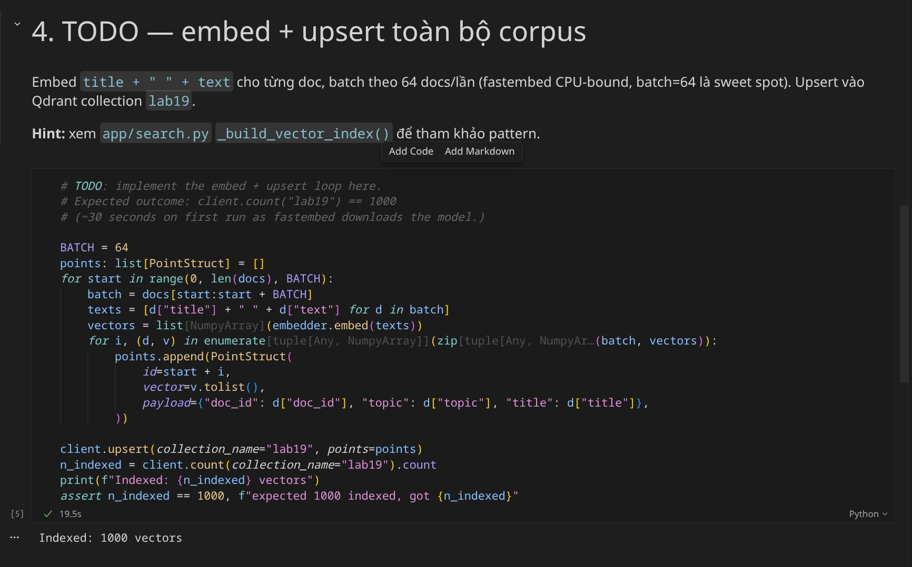

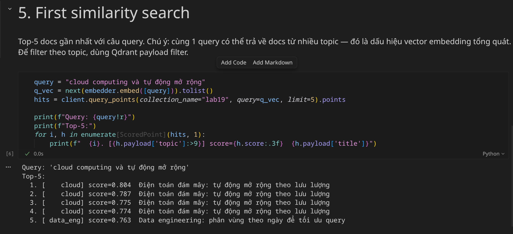

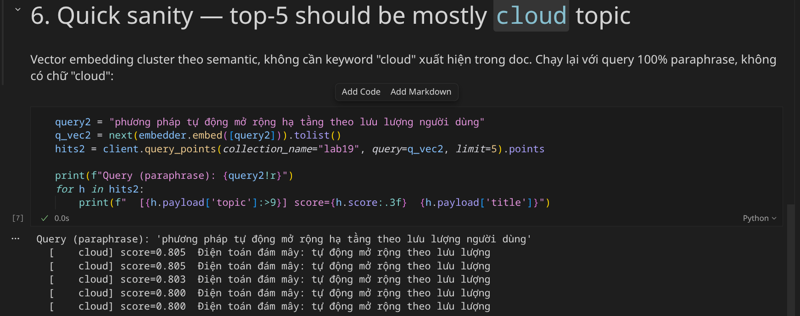

### NB2 — Hybrid Search & Precision@10

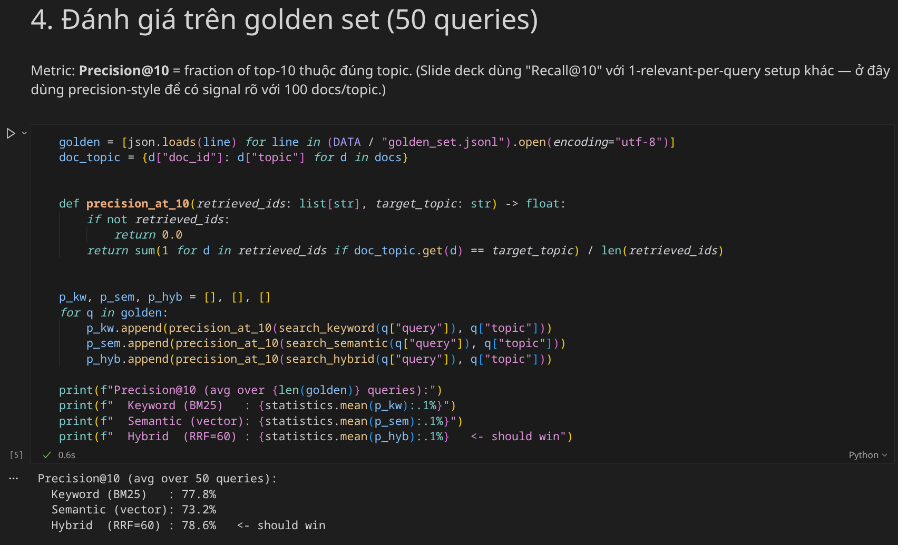

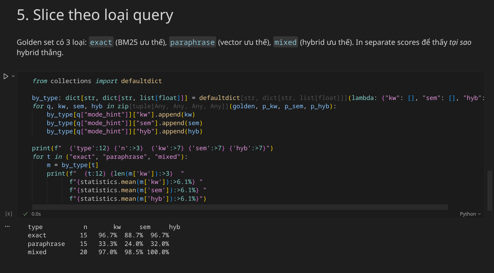

### NB3 — FastAPI Search Benchmark

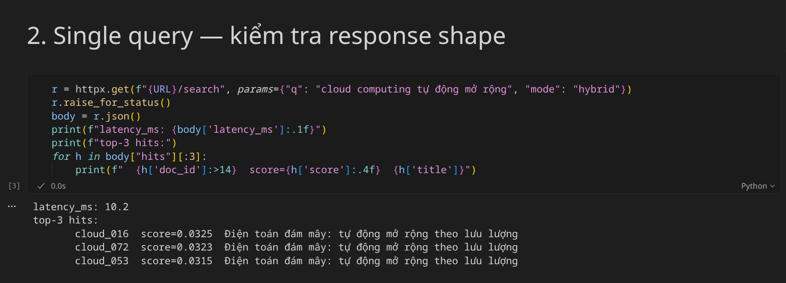

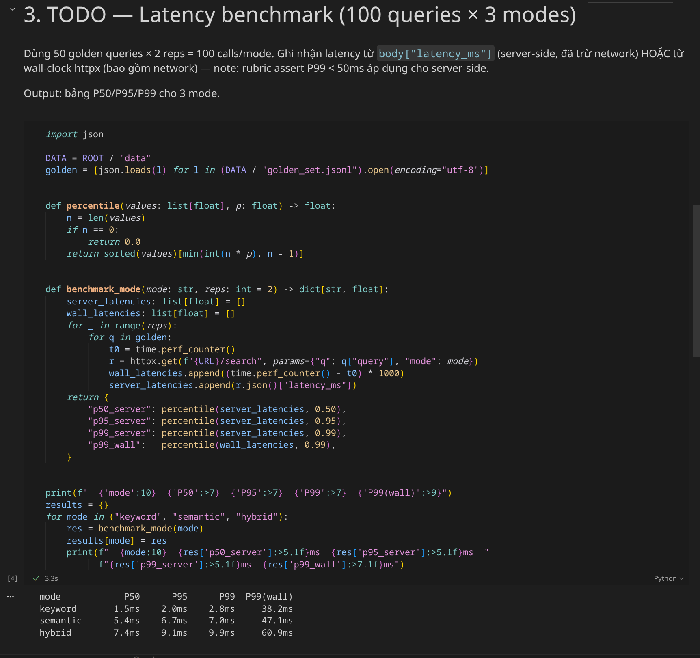

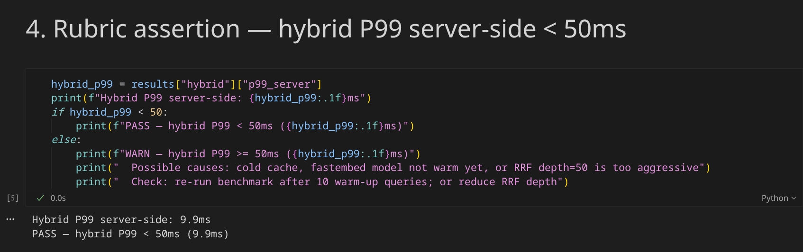

### NB4 — Feast Feature Store

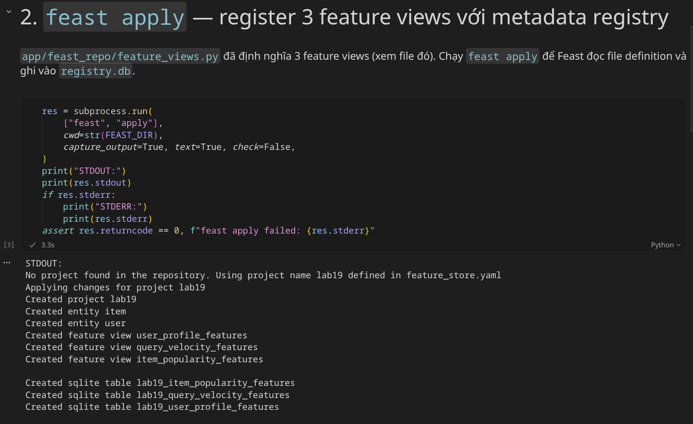

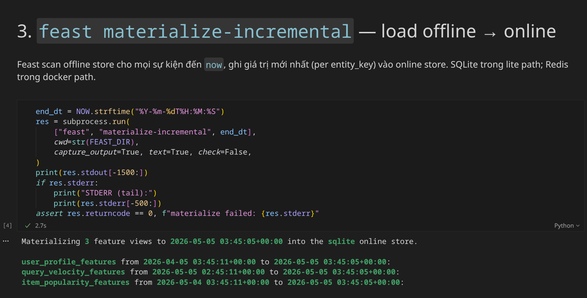

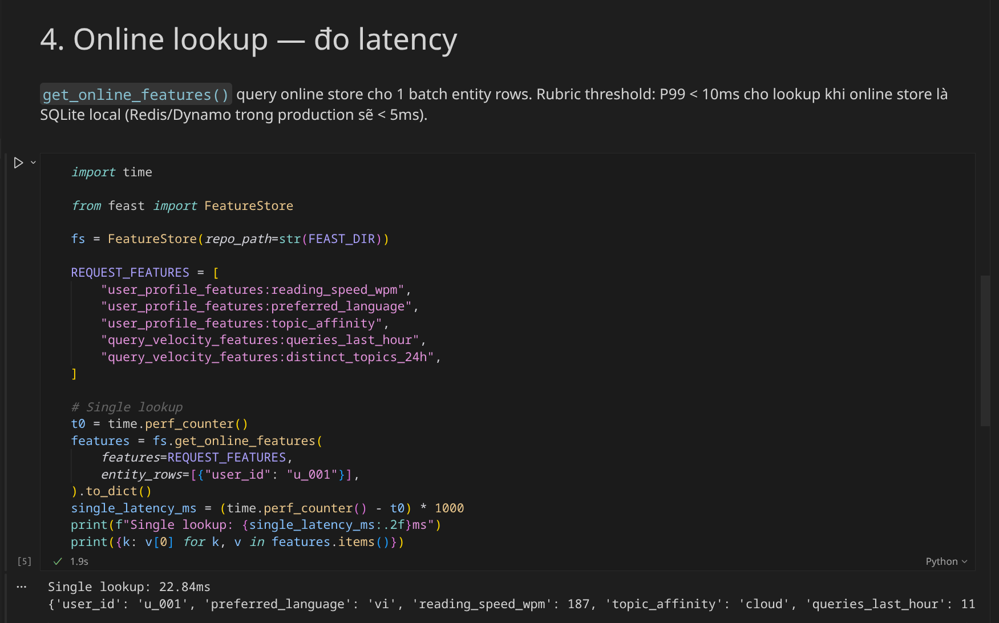

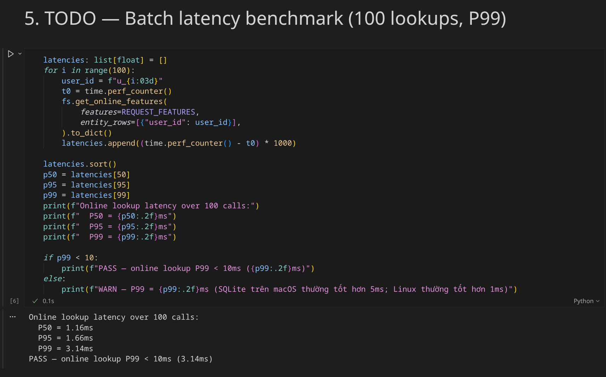

---

## Bonus challenge

- [ ] Đã làm bonus (xem `bonus/`)
- [ ] Pair work với: N/A
